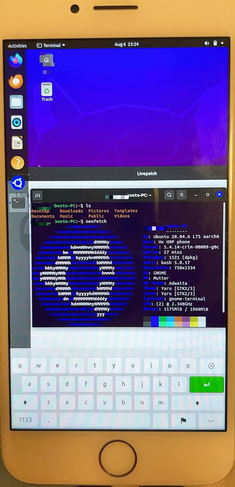
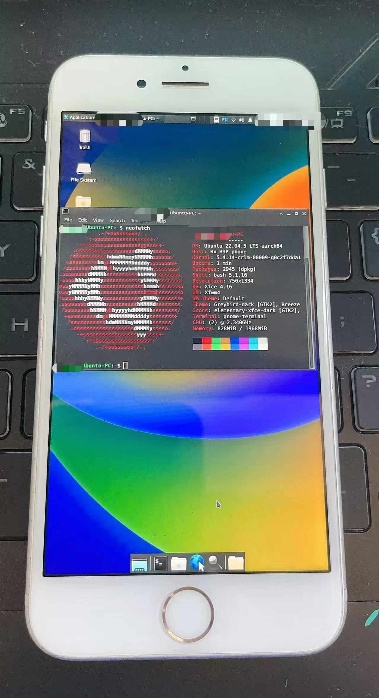

# uPhone

**uPhone** is an experimental dual-boot project for iPhone 7/7 Plus devices, allowing iOS 13.X and Ubuntu 22.04 to coexist.Basic hardware such as Wi-Fi, Bluetooth, and the touchscreen may work, (you can use Bluetooth keyboard / mouse / headphones, speakers and other Bluetooth devices.), but many other components, including the GPU, are likely non-functional. Devices with aftermarket modifications or third-party components may not function correctly.

It creates a USB gadget interface on the host. Set its IP to `172.16.1.2/255.255.255.0` to access the iPhone at `172.16.1.1`.

In the default Ubuntu desktop, color display may be incorrect (red and blue channels are swapped). This issue is not yet fixed. Using `XFCE4` can provide correct colors.

**This project is intended for personal research only.** It involves many high-risk operations that may **permanently damage your device**. Use at your own risk.

---

|  |  |
|:---------------------------:|:---------------------------:|
|Ubuntu on iPhone|Ubuntu on iPhone with xfce4|

---

## ⚠️ Disclaimer

- The project does **not guarantee success**.  
- The author is **not responsible** for any device damage, data loss, or other consequences.  
- In theory, this sets up iOS and Ubuntu dual-boot without losing iOS data, but **risks remain**.  
- **Back up all important files before proceeding**. Ensure there is no critical data stored on the device.  
- Follow instructions **exactly** as described.

---

## 📋 Requirements

- **Device:** iPhone 7 / 7 Plus only  
- **iOS Version:** 13.X (other versions are **not supported**)  
  - The project does **not support tethered downgrade devices**.  
- **Device Storage:** Recommended 128 GB or higher  
- **Dependencies on Host Computer:**  
  - `adb`  
  - `iproxy`
  - `sshpass`  
  - `debootstrap`  
  - `libusb-1.0-dev`
  - `binwalk`  
  - `lzma` / `xz`  
  - Standard Linux build tools (`gcc`, `make`,etc.)  
  - etc.

**Optional but recommended:** Backup your SHSH blobs and perform a clean restore before proceeding. For a clean iOS 13.X installation, you may use the [Turdus merula tool](https://sep.lol/).

---

## 🚀 Usage Guide

1. **Clone the repository:**  

   ```bash
   git clone https://github.com/Jinketomy-Masheldia/uPhone
   cd uPhone
   ```

2. **Set up resources:**

   ```bash
   bash ./01-setup-resources.sh
   ```

   > **Do this first** before running any other scripts.

3. **Prepare rootfs:**

   ```bash
   bash ./02-setup-rootfs.sh
   ```

4. **Partition the device:**

   - Prerequisite: Jailbreak iOS using `utils/jailbreak-ios.sh`
   - After the first jailbreak, please use the Checkra1n Loader application to **install Cydia and other jailbreak components.**
   - **Note:** This operation will remove all snapshots and **you will be unable to remove the jailbreak**.
   - run

     ```bash
     bash ./03-partition.sh
     ```

   > During this step, an Android image will also be installed to help install the Ubuntu rootfs.Make sure to **shrink iOS properly**; remaining space will be allocated to Ubuntu.

5. **Install Ubuntu rootfs:**

   - Prerequisite: Start Android using `utils/boot-android.sh` and connect to your computer

   - Run:

     ```bash
     bash ./04-install-rootfs.sh
     ```

6. **Build the Linux kernel and dtbpack:**

   ```bash
   bash ./05-build-kernel-dtb.sh
   ```

   > All compilation steps are performed inside the previously prepared rootfs using chroot, so they **will not affect the host system or its dependencies**.

7. **Boot Ubuntu:**

   - First, boot pongoOS using:

   ```bash
   bash ./utils/boot-pongoOS.sh
   ```

   - Then boot Ubuntu with:

   ```bash
   bash ./utils/boot-ubuntu.sh
   ```

---

## 🔹 Utility Scripts Notes

| Script                | Requirement / Prerequisite | Description                      |
| --------------------- | -------------------------- | -------------------------------- |
| `backup-ubuntu.sh`    | Booted to Android          | Backup the Ubuntu installed on iPhone|
| `boot-android.sh`     | Start from PongoOS         | Boot Android to install rootfs    |
| `boot-linux-sshrd.sh` | Start from PongoOS         | Boot a minimal Linux ramdisk for maintenance purposes |
| `boot-pongoOS.sh`     | Start from iOS / recovery  | Boot PongoOS                    |
| `boot-ubuntu.sh`      | Start from PongoOS         | Boot Ubuntu                      |
| `uninstall-ubuntu.sh` | Jailbroken iOS             | Remove Ubuntu and reclaim the storage space |

> Note: To boot pongoOS, you must use a USB-A port. USB-C is not supported. If the process repeatedly hangs or fails, it is recommended to restart both your computer and the iPhone.

---

## Credits

- **checkra1n team** – for the checkra1n jailbreak tool used for iOS 13.X devices.  
  [https://checkra.in](https://checkra.in)

- **Corellium** – for the Linux Sandcastle project.  
  - [https://github.com/corellium/linux-sandcastle](https://github.com/corellium/linux-sandcastle)  
  - [https://github.com/corellium/projectsandcastle](https://github.com/corellium/projectsandcastle)

- **libusb project** – required for compiling `load-linux` to interface with iOS devices.  
  [https://libusb.info/](https://libusb.info/)

- **Turdus merula tool** – recommended for clean restores to iOS 13.X.  
  [https://sep.lol/](https://sep.lol/)

- **Third-party tools under MIT licenses** by HoolockLinux included in resources:  
  - `resize_apfs`
  - `gdisk`

- **Special thanks** to all contributors and testers who helped refine the deployment and dual-boot process on iPhone 7/7 Plus devices.
